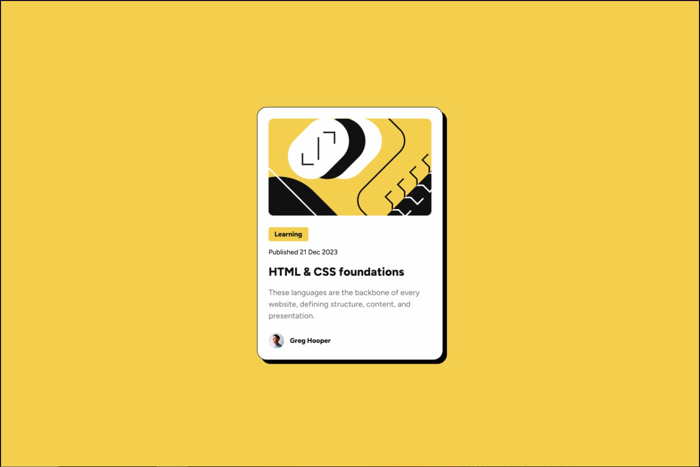

# Frontend Mentor - Blog preview card solution

This is a solution to the [Blog preview card challenge on Frontend Mentor](https://www.frontendmentor.io/challenges/blog-preview-card-ckPaj01IcS). Frontend Mentor challenges help improve coding skills by building realistic projects. 

## Table of contents

- [Overview](#overview)
  - [The challenge](#the-challenge)
  - [The Technologies Used](#technologies)
  - [Screenshot](#screenshot)
  - [Links](#links)
- [My process](#my-process)
  - [Built with](#built-with)
  - [What I learned](#what-i-learned)
  - [Continued development](#continued-development)
- [Author](#author)

## Overview
### The challenge ⚔
<a id="the-challenge"></a>

Users should be able to:

- See hover and focus states for all interactive elements on the page
  
### Technologies Used 🛠
<a id="technologies"></a>
`HTML`,`CSS`

### Screenshot 📸
<a id="screenshot"></a>



### Links
<a id="links"></a>
- Live Site URL: []() WILL UPLOAD SOON!  

## My process
<a id="my-process"></a>
### Built with
<a id="built-with"></a>

- Semantic HTML5 markup
- CSS custom properties
- Flexbox

### What I learned
<a id="what-i-learned"></a>
  Applied: `FlexBox`, `Descendant combinator`, `@font-face`
```css
.proud-of-this-css :
  @font-face{
    
  }
```

### Continued development
<a id="continued-development"></a>
For future development, I might make it more interactive using `JS`! 

## Author
<a id="author"></a>

[//]: # (- Website - [Add your name here]&#40;https://www.your-site.com&#41;)
- Frontend Mentor - [@Conan](https://www.frontendmentor.io/profile/ZYMNZ)
